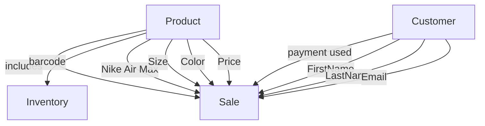

### Entity Descriptions
1. **Product**: Represents different models of Nike shoes available in the store. Attributes include:
   * **Nike Air Max**: The model of a shoe used in this example.
   * **Size**: The available sizes for the shoes.
   * **Color**: The color options for the shoes.
   * **Price**: The selling price of the shoes.

2. **Customer**: Contains information about customers who purchase shoes. Attributes include:
   * **FirstName**: The first name of the customer.
   * **LastName**: The last name of the customer.
   * **Email**: The email address for contact.

3. **Sale**: Records transactions linking customers to the products they buy, indicating:
   * **Payment Used**: The payment method used by the customer for the sale.

4. **Inventory**: Tracks stock levels for each product, using:
   * **Barcode**: A unique identifier for the products in the inventory.

### Relationship Descriptions

* **Product includes Sale**: Each product can be included in multiple sales transactions.

- **Customer payment used in Sale**: Customers can use different payment methods for their purchases.

- **Product tracked by Inventory**: Each product's stock level is monitored and identified by its barcode.
